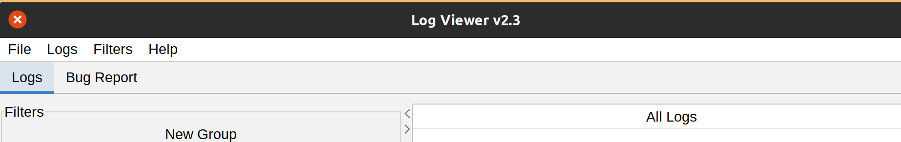

# Bug Report

When a bugreport file is loaded, Logviewer can parse and showits logs in the "Logs" tab, while some other information like packages, carrier config resources or general properties are displayed in the "Bug Report" tab

