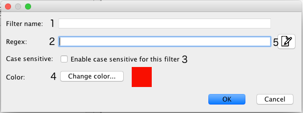

# Creating Filters
Filters are an essential piece of Log Viewer. Your filters can be as simple as a single Word or as complex as you want using regex, they can be case sensitive or not.

You can define a name and a color for each filter so you can easily differentiate them.

## New Filter Dialog
When you click on the '+' button to create a new filter, this is what you will see:

1. **Filter name** - You can define a name for your filter (It is optional, the default is the same as your filter query) - This is the name that will appear on the Filters List. This is useful when your query is a complex regex and you want a clear name to be displayed on the filters list.
1. **Regex** - Your filter query (you can use any regex you want)
1. **Case sensitive** - Whether or not you want your query to be case sensitive
1. **Filter color** - Select a color for your filter so you can differentiate multiple filters applied to your logs
1. **Regex editor** - In case you want to do a complex query, regex editor can help you (See more in [Regex Editor](./regex-editor.html))