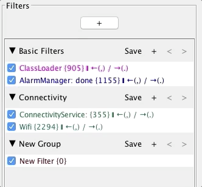

# Filters
Filters are an essential piece of Log Viewer. Your filters can be as simple as a single Word or as complex as you want using regex. They can be case sensitive or not.

You can define a name and a color for each filter so you can easily differentiate them when applied to your set of logs.

## Filters Groups
You can easily organize all your filters by categorizing them in groups

- To add a new group, simply click the "+" button above the filters list
- To add a new filter, simply click the "+" button on the group in which that filter should belong to

## Applying Filters
In order to apply/unapply one or more filters, just click the check box next to it (Or select all filters you want to apply/unapply and hit space bar)

## Applied Filters information
You will notice, when applying one or more filters, that some information is presented next to it:

On the above image, the applied filter is **'ClassLoader'**, and you can see that some aditional information is shown: **ClassLoader {905} &#10073; &#8592; (,) / &#8594; (.)_**

* **{11}** - Means there are 905 occurrences of this filter on the st of logs
* **&#8592; (,)** - Means you can use _,_ to navigate backward through the occurrences of this filter
* **&#8594; (.)** - Means you can use _._ to navigate forward through the occurrences of this filter

## Navigating through filtered logs
You can click '<' and '>' buttons (or use _,_ and _._ keyboard shortcuts) to navigate through all the occurrences of the filtered logs matching the selected filter.

## Manage Filters
- Simply Drag n' Drop the filters (on the same group) to re-order them
- Double click a filter or _right click > Edit_ to edit an existing filter
- Select the filter(s) you want to delete and press _Delete_ or _right click > Delete_

## Create Filter from Log
A nice shortcut to creating a new filter is by selecting one log line (In the All Logs View) and _right click > Create Filter from this line..._. This will automatically take you to the Regex Editor prepopulating it with the contents of that particular log line so you can edit and create a filter based on it.