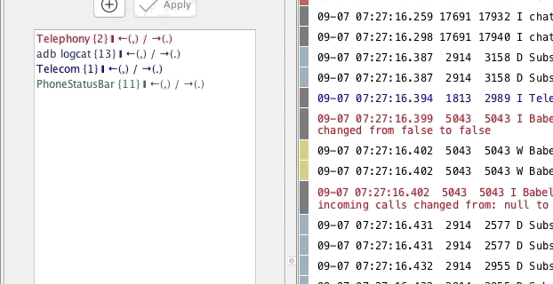

# Managing Filters
## Create new filter
For creating a new filter, check [Creating filters](./creating-filters.html).

## Re-ordering filters
Simply Drag n' Drop the filters to re-order them

## Edit a filter
Double click a filter or _right click > Edit_ to edit an existing filter

## Delete a filter
Select the filter(s) you want to delete and press _Delete_ or _right click > Delete_