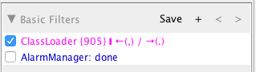

# Navigating Through the Filters
You will notice, when applying one or more filters, that some information is presented next to it:

On the above image, the applied filter is **'PhoneStatusBar'**, and you can see that some aditional information is shown: **_PhoneStatusBar {11} &#10073; &#8592; (,) / &#8594; (.)_**

* **{11}** - Means there are 11 occurrences of this filter on the st of logs
* **&#8592; (,)** - Means you can use _,_ to navigate backward through the occurrences of this filter
* **&#8594; (.)** - Means you can use _._ to navigate forward through the occurrences of this filter

So, you can use _,_ and _._ to navigate through the selected filter on the set of logs. Like shown below:

