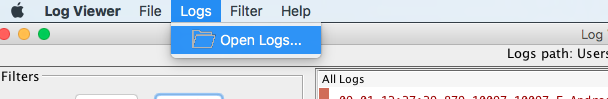
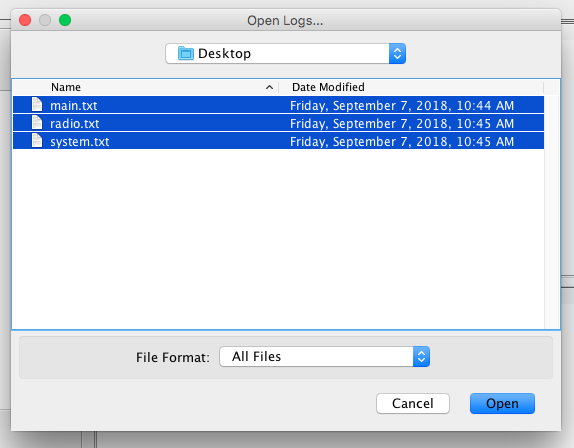
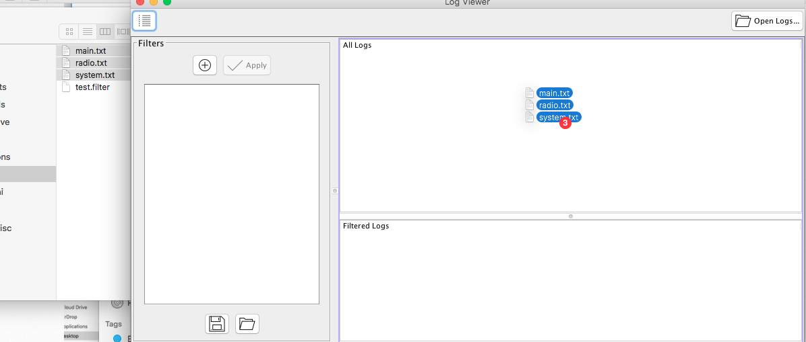

# Opening Logs
To open a new set of logs, you have 2 options:

## Open logs menu
Choose 'Logs > Open Logs' from the toolbar menu

Navigate to the folder where the logs are and select all the logs you wish to open

## Drag n' Drop
Alternatively, you can simply select all the log files from your file system and drag and drop them to the 'All Logs' panel
