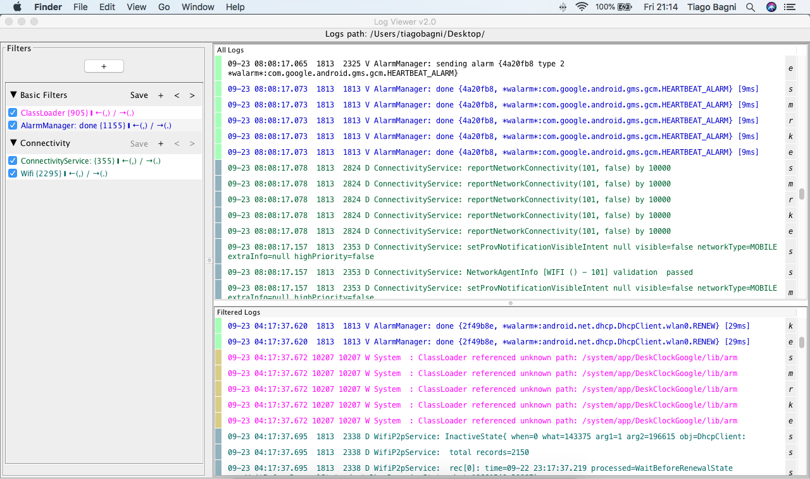

# Overview
## Basic functions

### Filters
With LogViewer it is possible to create one or more filters and organize them into groups. Each group can be saved in a different file, making it possible to create different sets of filters and use the ones are more appropriate for each time.

Filters can be expressed in the form of regular expressions so it is easy to perform complex and specific searches on the logs. They are identified by a name (Which can be the query itself if readable) and are distinctable by color, so it is really easy to identify which log lines are a result of which applied filter.

### Logs
LogViewer will automatically merge and sort all the log files you open and present it to you in a chronological way. The Logs View is divided in 2: the "All Logs" View and the "Filtered Logs" View. The first one will contain all the logs from all the opened files, and the secon one will contain only the log lines that matches one or more of the applied filters identified by the filter color. This is a great way to only read what matters (Filtered Logs View) without losing the context of what happened (All Logs View)

### Streams
Sometimes the logs can be categorized into different streams (main, system, radio...). Log Viewer will automatically detect these cases when you open more than one log file that represent these different streams.
When more than one stream is identified by LogViewer, it will indicate, for each log line, which filter that line belongs to.
It is also possible to exclude some streams from the filtered view temporarily by selecting which streams you wish to visualize from the "Streams" menu. 