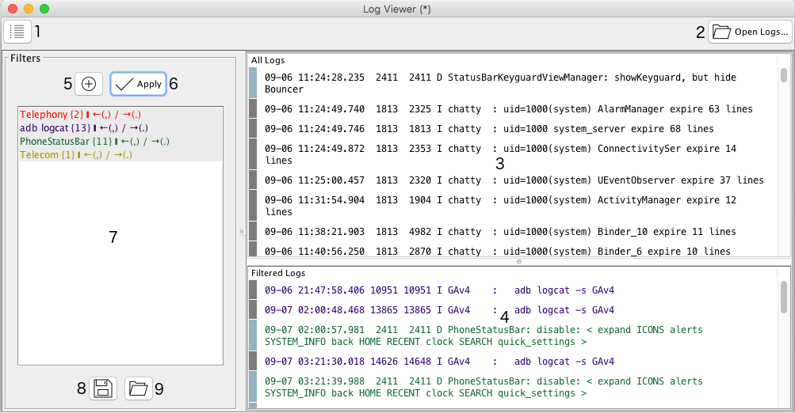

# Overview
## Basic functions

### 1 - Menu
Open options menu:
* Settings (Custom user preferences)
* Open new window (Useful when you need to compare different set of logs)

### 2 - Open Logs
Open one or more log files to be displayed on the 'Log View' panel. You can also just drag the log files from the file system and drop them on the 'Log View' panel.

### 3 - All Logs
This is where your logs will be displayed, merged and in a chronological order

### 4 - Filtered Logs
When one or more log filters are applied, this is where the filtered logs will be presented

### 5 - New Filter
Create a new filter. It can be as simple as a single word or as comples as you want using regex.

### 6 - Apply filters
Apply all selected filters (on the filters list) to the opened set of logs

### 7 - Filters list
This is where all the created filters will be displayed

### 8 - Save filters
You can save your filters o disk so it is easily accessible in the future. Without having to create them all over again every time. (Default folders for filters is used as the starting point location of the file chooser)

### 9 - Open filters
Open a previously saved list of filters. (Default folders for filters is used as the starting point location of the file chooser)