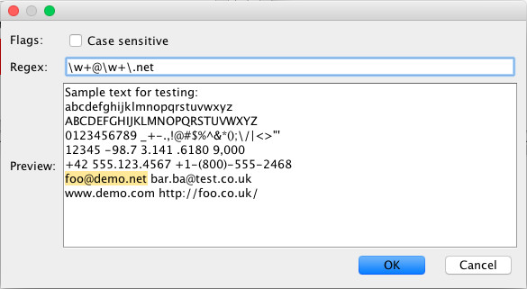
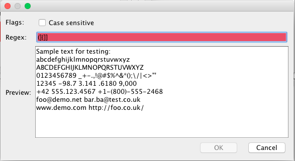

# The Regex Editor
Log Viewer comes with a built-in regex editor to help you create complex queries for your filtes.
Just type your regex on the 'Regex' field and it will highlight the text below (which can be anything you want) automatically, so you can see your regex in practice. If your regex has a syntax error, Regex Editor will tell that to you by turning the 'Regex' field red

