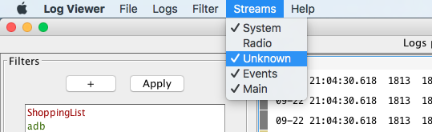

# Log Streams
Android can separate its logs in different streams:
* main
* radio
* system
* events
* kernel

LogViewer will identify these streams when more than one log file is opened (and these log files follow the android naming standard - which includes the stream)

## Identifying different streams
When more than one stream is identified, each log line will show an indication of which stream that log line belongs:

## Enabling/disabling streams for the filtered output
When more than one stream is identified, a 'Streams' menu will appear on the toolbar. This menu allows to enable/disable each stream. Only the enabled streams will appear on filtered output.

Streams will be enabled/disabled instantly. There is no need to apply the filters again